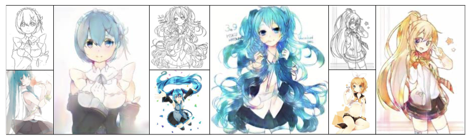
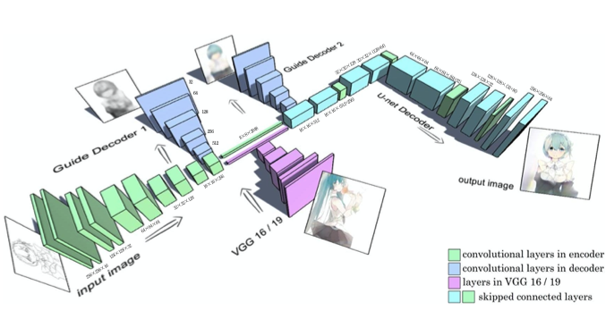
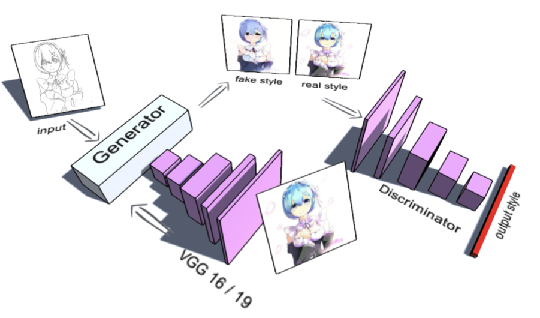

# Style Transfer for Anime Sketches with Enhanced Residual U-net and Auxiliary Classier GAN

[Paper](https://arxiv.org/pdf/1706.03319.pdf)

## Model

### Generator

### Discriminator

## Requirements

- pytorch==1.10.0
- albumentations==1.1.0
- opencv-python-headless==4.5.5.62
- wandb==0.12.10
- easydict==1.9
- tqdm==4.62.3

## Reference

- https://arxiv.org/pdf/1706.03319.pdf
